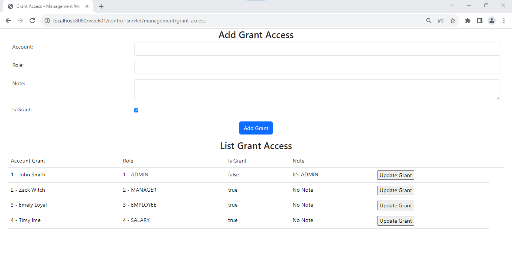

# Đăng Nhập
Khi chạy website màn hình **đăng nhập** hiển thị đầu tiên, nhập *tài khoản email* và *mật khẩu* để có thể đăng nhập

> Email và mật khẩu đều có ràng buộc về mặt ký tự và có kiểm tra đúng sai

# Hiển thị thông tin
Khi đăng nhập thành công thì trang tiếp theo sẽ là trang hiển thị toàn bộ thông tin của người đăng nhập đó cùng với đó là danh sách các quyền mà người đó có

Nếu tài khoản là **Admin** thì admin sẽ có quyền quản trị, điều khiển website

> Trường hợp không phải **Admin**

> Trường hợp là **Admin**

Ngoài ra, **Admin** sẽ được *full* quyền, có thể quản lý bất kỳ danh mục nào của website.

# Quản lý

Đây là trang quản lý nhân viên, điều hướng của phần **Quản lý nhân viên**

> Hiển thị danh sách các nhân viên, Từ đó **Admin** có thể thực hiện thêm, xoá, sửa nhân viên

Đây là trang quản lý role, giúp cho **Admin** có thể thực hiện tạo, sửa, xoá các role để dễ dàng phân quyền nhân viên của mình

Đây là trang quản lý và phân quyền, nơi mà **Admin** sẽ thực hiện phân quyền các nhân viên

!

Đây là trang quản lý log, nơi mà hệ thống sẽ ghi lại lịch sử thời gian đăng nhập, đăng xuất của các nhân viên

